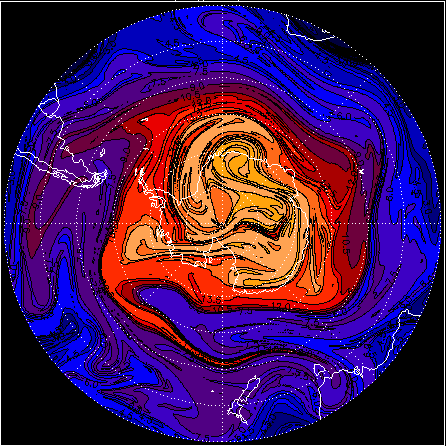

# MIMOSA

MIMOSA is a high-resolution potential vorticity advection model developed in Fortran by A. Hauchecorne (Hauchecorne et al., 2002). It is initialized at a time `t` from ECMWF data (horizontal wind fields U and V, temperature and pressure) on an orthogonal grid centered on the north pole. MIMOSA calculates then advects the potential vorticity on isentropic surfaces with a spacial resolution of 1/3 or 1/6 of a degree.

<p align="center">
    
</p>

## Requirements
The MIMOSA tool is containerized into a Singularity container so one must have Singularity installed on the host system intended for simulations.

## Installation
```
git clone https://github.com/aeris-data/mimosa.git
sudo singularity build ./mimosa.sif ./mimosa-container.def
```
The `singularity build` command will build the container `mimosa.sif` from its definition file, using the source files got from the git repo; so for the build it is important to call the command from the git repo directory that one has made. 

⚠️ ***The build requires either sudo rights or being able to use `--fakeroot` option (in a case of a multi-user server).*** 

Afterwards, the sif image can be placed anywhere (even on another system) independently of the source files. To run the image no sudo rights are required.

## Usage
The main script is `mimosa-user-script.sh` which needs the input configuration file user-config.conf (which can be renamed, the name is not important). This bash script handles user's input parameters, launch simulations and post-process simulation results. The main usage is 
```
./mimosa-user-script.sh --config user-config.conf
```

⚠️ ***The script must be launched inside the Singularity container.***

In the simulation working directory the one must have a tree folder `GRIB/[year of the data in YYYY format]/[month of the data in MM format]` where the meteorological GRIB files with names `DYYMMDDHH.grib` must be stored. The outputs of the simulation are : estimated temperature and potential vorticity in binary and netCDF format + PNG map plots of the data. More details about input/output and folder structure are in the manual `SEDOO-AERIS-DT-005-MAG_MIMOSA_ATBD.pdf`.


### Bind option

The `--bind` option allows to map directories on the host system to directories within the container. Most of the time, this option allows to solve the error *"File (or directory) not found"*, when all of the paths are configured correctly but the error persists. Here is why it can happen. When Singularity ‘swaps’ the host operating system for the one inside your container, the host file systems becomes partially inaccessible. The system administrator has the ability to define what bind paths will be included automatically inside each container. Some bind paths are automatically derived (e.g. a user’s home directory) and some are statically defined (e.g. bind paths in the Singularity configuration file). In the default configuration, the directories $HOME , /tmp , /proc , /sys , /dev, and $PWD are among the system-defined bind paths. Thus, in order to read and/or write files on the host system from within the container, one must to bind the necessary directories if they are not automatically included. Here’s an example of using the `--bind` option and binding `/data` on the host to `/mnt` in the container (`/mnt` does not need to already exist in the container):

```
$ ls /data
bar  foo

$ singularity exec --bind /data:/mnt my_container.sif ls /mnt
bar  foo
```

You can bind multiple directories in a single command with this syntax:

```
$ singularity shell --bind /opt,/data:/mnt my_container.sif
```

This will bind `/opt` on the host to `/opt` in the container and `/data` on the host to `/mnt` in the container.

## Input meteorological data extraction
The input data for the simulations is meteorological data : wind, temperature and logarithm of surface pressure, coming from the ECMWF database. To extract and prepare the data in the correct format, the script `mimosa-extract-grib.sh` or `mimosa-extract-ecmr.sh` should be used :
```
./mimosa-extract-grib.sh --config grib.conf
./mimosa-extract-ecmr.sh --config ecmr.conf
```
These scripts extract the data either in the GRIB or ASCII (ECMR) format, respectively. The user can configure the start and end date of the data, as well as the spatial resolution, and the data class (only in the grib version). The configuration of two data extractions are as follows:
- GRIB data
    - extracted on ECMWF 137 model levels
    - the timestep is 3 hours if the requested date range is up to J+6; if the end date exceeds the J+6 limit, the timestep is 6 hours
- ECMR data
    - extracted on 17 pressure levels
    - the timestep is 12 hours

The script must be launched on the ECMWF MARS server (ecs, hpc or other). The data extraction was tested with a member-state user account. Other more public accounts might customize the script based on the MARS services or APIs available for their type of user. The data is extracted and stored in the directory requested in the input configuration; afterwards, the data can be used for the simulation. The transfer of the data to the host where the simulation will be executed is to be done by the user.
